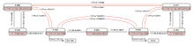
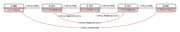

# IFC Plus Ontology Documentation

## Overview

The IFC Plus ontology (`ifcPlus`) extends the standard IFC4x3 ontology (`ifc`) with additional classes and properties designed to simplify queries related to building distribution systems. This extension provides direct relationships between elements that would otherwise require complex path traversals through intermediate entities in the base IFC schema.

**Namespaces:**
- `ifc:` — `http://ifcowl.openbimstandards.org/IFC4x3#`
- `ifcPlus:` — `http://ifcowl.openbimstandards.org/IFC4x3plus#`

---

## Classes

### ifcPlus:Device

A **Device** is any `ifc:IfcDistributionFlowElement` that is not an `ifc:IfcFlowSegment` or `ifc:IfcFlowFitting`. Devices represent active or functional components within a distribution system, such as valves, pumps, boilers, or terminals.

The following IFC classes are defined as subclasses of `ifcPlus:Device`:

- `ifc:IfcFlowController` — valves, dampers, switches
- `ifc:IfcFlowTreatmentDevice` — filters, interceptors
- `ifc:IfcEnergyConversionDevice` — boilers, chillers, heat exchangers
- `ifc:IfcFlowTerminal` — outlets, fixtures, air terminals
- `ifc:IfcFlowMovingDevice` — pumps, fans, compressors
- `ifc:IfcFlowStorageDevice` — tanks, vessels
- `ifc:IfcDistributionControlElement` — sensors, controllers, actuators

### ifcPlus:FlowCarrier

A **Flow Carrier** is any `ifc:IfcDistributionElement` that serves to transport a medium (such as water, air, or electricity) between devices. Flow carriers are passive conduits rather than functional equipment.

The following IFC classes are defined as subclasses of `ifcPlus:FlowCarrier`:

- `ifc:IfcFlowSegment` — pipes, ducts, cables
- `ifc:IfcFlowFitting` — elbows, tees, junctions

---

## Object Properties

### Spatial Relationships

#### ifcPlus:HasLocation / ifcPlus:IsLocatedIn

These properties directly link distribution elements to their containing spatial structure elements (buildings, storeys, spaces) without requiring traversal through `ifc:IfcRelContainedInSpatialStructure`.

| Property | Domain | Range |
|----------|--------|-------|
| `ifcPlus:HasLocation` | `ifc:IfcDistributionElement` | `ifc:IfcSpatialStructureElement` |
| `ifcPlus:IsLocatedIn` | `ifc:IfcSpatialStructureElement` | `ifc:IfcDistributionElement` |

These properties are inverses of each other.

### Property Set Relationships

#### ifcPlus:HasPropertySet / ifcPlus:IsPropertySetOf

In the base IFC schema, property sets are linked to objects through `ifc:IfcRelDefinesByProperties`, requiring traversal through `ifc:IsDefinedBy`, `ifc:RelatedObjects`, and `ifc:RelatingPropertyDefinition`. The `ifcPlus:HasPropertySet` property provides a direct shortcut.

| Property | Domain | Range |
|----------|--------|-------|
| `ifcPlus:HasPropertySet` | `ifc:IfcObject` | `ifc:IfcPropertySet` |
| `ifcPlus:IsPropertySetOf` | `ifc:IfcPropertySet` | `ifc:IfcObject` |

These properties are inverses of each other.

### Port Relationships

Ports are connection points on distribution elements. The IFC Plus ontology introduces shortcut properties that directly link elements to their ports without requiring traversal through `ifc:IfcRelNests` relationships.

#### ifcPlus:HasPort / ifcPlus:IsPortOf

The `ifcPlus:HasPort` property directly connects an `ifc:IfcDistributionElement` to its `ifc:IfcDistributionPort` instances. In the base IFC schema, this relationship requires navigating through an `ifc:IfcRelNests` entity using `ifc:IsNestedBy`, `ifc:RelatingObject`, and `ifc:RelatedObjects`. The shortcut property eliminates this indirection.

| Property | Domain | Range |
|----------|--------|-------|
| `ifcPlus:HasPort` | `ifc:IfcDistributionElement` | `ifc:IfcDistributionPort` |
| `ifcPlus:IsPortOf` | `ifc:IfcDistributionPort` | `ifc:IfcDistributionElement` |

These properties are inverses of each other.

#### ifcPlus:FeedsPort / ifcPlus:IsFedByPort

The `ifcPlus:FeedsPort` and `ifcPlus:IsFedByPort` properties establish directional relationships between ports based on their flow direction. A port with `FlowDirection = SOURCE` feeds into another element, while a port with `FlowDirection = SINK` receives flow. These properties shortcut the path through `ifc:IfcRelConnectsPorts` using `ifc:RelatingPort` and `ifc:RelatedPort`.

| Property | Domain | Range |
|----------|--------|-------|
| `ifcPlus:FeedsPort` | `ifc:IfcDistributionPort` | `ifc:IfcDistributionFlowElement` |
| `ifcPlus:IsFedByPort` | `ifc:IfcDistributionFlowElement` | `ifc:IfcDistributionPort` |

These properties are inverses of each other.

### Flow and Connectivity Relationships

#### ifcPlus:Feeds / ifcPlus:IsFedBy

The `ifcPlus:Feeds` property provides a direct connection between two `ifc:IfcDistributionFlowElement` instances, indicating that one element supplies a medium to another. This abstracts away the port-level details and the intermediate `ifc:IfcRelConnectsPorts` relationship.

| Property | Domain | Range |
|----------|--------|-------|
| `ifcPlus:Feeds` | `ifc:IfcDistributionFlowElement` | `ifc:IfcDistributionFlowElement` |
| `ifcPlus:IsFedBy` | `ifc:IfcDistributionFlowElement` | `ifc:IfcDistributionFlowElement` |

These properties are inverses of each other.

#### ifcPlus:FeedsIndirectly / ifcPlus:IsFedByIndirectly

The `ifcPlus:FeedsIndirectly` property is a **transitive property** that connects flow carriers (pipes, ducts, fittings) that are part of the same flow path, even when separated by multiple intermediate segments. Because this property is transitive, if element A feeds element B, and element B feeds element C, then A also feeds C indirectly.

| Property | Domain | Range | Type |
|----------|--------|-------|------|
| `ifcPlus:FeedsIndirectly` | `ifcPlus:FlowCarrier` | `ifcPlus:FlowCarrier` | `owl:TransitiveProperty` |
| `ifcPlus:IsFedByIndirectly` | `ifcPlus:FlowCarrier` | `ifcPlus:FlowCarrier` | `owl:TransitiveProperty` |

These properties are inverses of each other.

#### ifcPlus:IsConnectedTo / ifcPlus:IsConnectedFrom

These properties establish that two devices are connected through some path of flow carriers (pipes, ducts, or wires). Unlike the `Feeds` properties that work at the flow element level, these properties specifically connect `ifcPlus:Device` instances, abstracting away the intermediate flow carriers entirely.

| Property | Domain | Range |
|----------|--------|-------|
| `ifcPlus:IsConnectedTo` | `ifcPlus:Device` | `ifcPlus:Device` |
| `ifcPlus:IsConnectedFrom` | `ifcPlus:Device` | `ifcPlus:Device` |

These properties are inverses of each other.

## Reasoning

The IFC Plus ontology relies on custom inference rules to derive shortcut properties from the underlying IFC data. Because the required reasoning patterns exceed what standard OWL 2 profiles (RL, DL, EL) can express, we use GraphDB's custom ruleset mechanism.

| Rule | Description |
|------|-------------|
| `ifcHasPropertySet` | Derives `ifcPlus:HasPropertySet` by traversing `ifc:IsDefinedBy` → `ifc:IfcRelDefinesByProperties` → `ifc:RelatingPropertyDefinition`. |
| `ifcHasLocation` | Derives `ifcPlus:HasLocation` by traversing `ifc:ContainsElements` → `ifc:IfcRelContainedInSpatialStructure` → `ifc:RelatedElements`. |
| `ifcHasPort` | Derives `ifcPlus:HasPort` by traversing `ifc:IsNestedBy` → `ifc:IfcRelNests` → `ifc:RelatedObjects`. |
| `ifcFeedsPortA/B` | Derives `ifcPlus:FeedsPort` between ports connected via `ifc:IfcRelConnectsPorts`, respecting `FlowDirection` (SOURCE → SINK). Two rules handle both port assignment patterns. |
| `ifcFeeds` | Derives `ifcPlus:Feeds` between distribution elements when their ports are connected via `ifcPlus:FeedsPort`. |
| `ifcFeedsIndirectly` | Derives `ifcPlus:FeedsIndirectly` between flow carriers. Transitivity (defined in axioms) then propagates this relationship along chains of segments and fittings. |
| `ifcIsConnectedToDirect` | Derives `ifcPlus:IsConnectedTo` when two devices are separated by a single flow carrier. |
| `ifcIsConnectedToIndirect` | Derives `ifcPlus:IsConnectedTo` when two devices are separated by multiple flow carriers linked via `ifcPlus:FeedsIndirectly`. |

## Summary

The IFC Plus ontology provides a set of shortcut properties and convenience classes that simplify SPARQL queries over IFC-based building data. 
